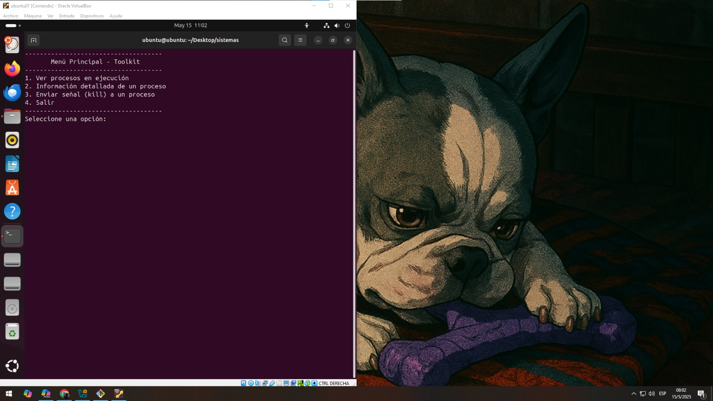

# 🛠️ Toolkit de Procesos en Bash
Este proyecto es un <strong> menú interactivo</strong> en Bash que permite gestionar procesos en ejecución en un sistema Linux. Es ideal para estudiantes, administradores de sistemas o cualquier persona que quiera practicar scripting en Bash y manejo de procesos.

<figure></figure>

## 📂 Estructura del proyecto
- System
- ├── main_toolkit.sh      # Script principal con el menú
- ├── procesos.sh          # Script que gestiona los procesos según la opción elegida
- └── README.md            # Documentación del proyecto

## 🚀 ¿Cómo ejecutar este proyecto?
Cloná o copiá los archivos a una carpeta local.
Abrí una terminal y navegá al directorio del proyecto.

#### Asigná permisos de ejecución:
- chmod +x main_toolkit.sh
- chmod +x procesos.sh
- Ejecutá el script principal: ./main_toolkit.sh

## 📋 Funcionalidades disponibles
Desde el menú principal podrás:

#### Ver procesos en ejecución
- Muestra todos los procesos actuales del sistema usando ps aux, en modo paginado (less).

#### Ver información detallada de un proceso
- Podés ingresar el PID de un proceso para ver su uso de memoria, CPU, tiempo de ejecución, etc.

#### Matar un proceso
- Permite ingresar el PID de un proceso y finalizarlo con kill -9.

#### Crear archivo
- Permite crear un archivo indicando nombre y extensión requerida.

#### Visualizar informacion de la memoria RAM y SWAP
- Ver memoria en uso actual.

- Salir de la app. 

## ✅ Requisitos
- Sistema operativo: Linux

- Intérprete de comandos: bash

- Acceso a una terminal

- Permisos de ejecución

## 💡 Sugerencias de uso
Podés usar este proyecto como base para:

- Crear herramientas administrativas personalizadas.

- Aprender scripting Bash.

- Practicar control de procesos.

- Se recomienda ejecutarlo en una máquina virtual si vas a experimentar con procesos reales.

- Es posible que surjan errores al ejecutar el programa por problemas de "Finales de línea" comunes cuando se programa en windows y se ejecuta en Linux o viceversa. Para solucionar esto una buena opción es usar "dos2unix" en tu sistema Linux sobre el archivo problemático. 
Se instala con:  sudo apt install dos2unix
Se ejecuta sobre cada archivo por ej: dos2unix procesos.sh

